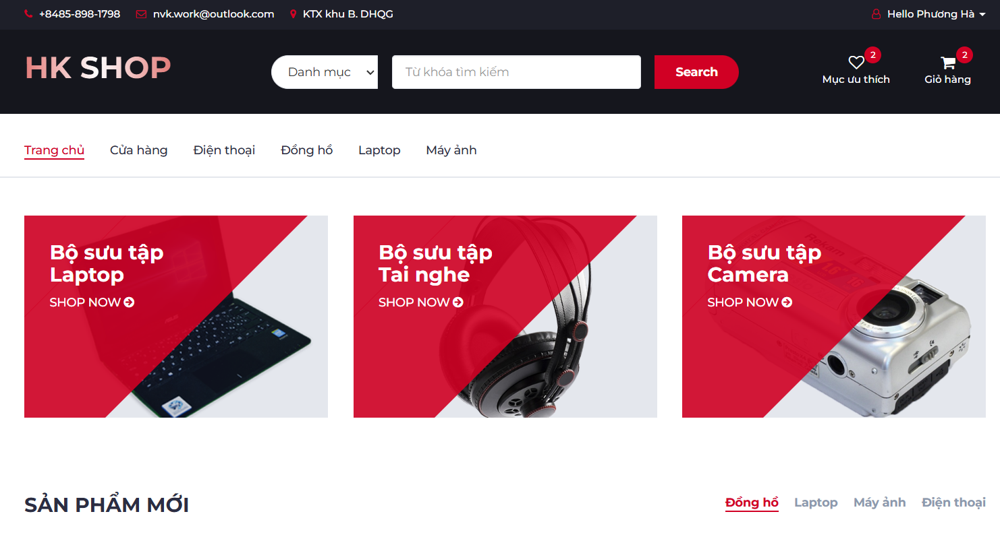

<div align="center">

# 🛍️ HK Technology Shop

_A Web Application for Technology Product Shopping using ASP.NET MVC_ 💻




</div>

## 📘 Table of Contents

1. [Introduction](#introduction) 🌟
2. [Technologies](#technologies) 🛠️
3. [Features](#features) 🔎
4. [Getting Started](#getting-started) 🚀
5. [Contact](#contact) 📫

---

## 🌟 Introduction

**HK Technology Shop** is a personal web application developed to support the shopping experience for technology-related products. Built with C# using the ASP.NET MVC architecture, the application offers full functionality for both customers and administrators.

---

## 🛠️ Technologies

- **C# (ASP.NET MVC):** Backend logic and MVC architecture.
- **Bootstrap & HTML:** Modern, responsive frontend interface.
- **SQL Server:** Database management for products, customers, orders, and more.

---

## 🔎 Features

### 🎯 **Customer Flow**

- Browse tech product catalog
- Add products to cart
- Place orders
- Track shipping
- Pay invoices
- Register and log in to your account using JWT
- Checkout using PayPal or Cash on Delivery (COD)

### 🛠️ **Admin Flow**

- Manage products
- Manage customers
- Manage orders
- Manage categories
- Manage suppliers

---

## 🚀 Getting Started

### ✅ Prerequisites

Make sure you have the following installed:

- **Visual Studio 2022** (or later)
- **SQL Server Management Studio**
- **.NET Framework** (suitable for ASP.NET MVC projects)

### 📂 Installation & Setup

1. **Clone the Repository**

   ```bash
   git clone https://github.com/OriginalNVK/ECommerce-HKShop.git
   cd ECommerce-HKShop
   ```

2. **Configure the Database**

   - Open SQL Server Management Studio
   - Execute the SQL script located at: `HKShop/HShopDB.sql`
   - This will create and initialize the database.

3. **Run the Application**
   - Open the solution file in Visual Studio
   - Press `F5` or `Ctrl + F5` to build and launch the project
   - Navigate to: `https://localhost:7272/`

---

## 📫 Contact

**Nguyen Van Khanh**

🔗 GitHub: [OriginalNVK](https://github.com/OriginalNVK)  
📧 Email: khanh25051999@gmail.com
